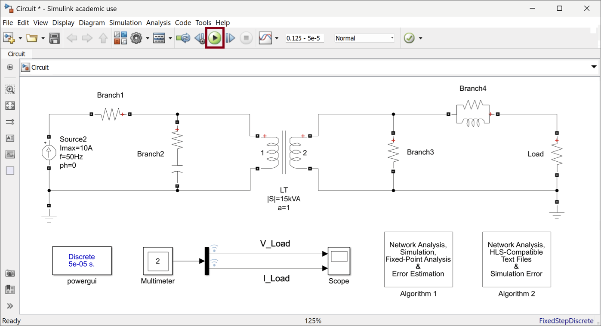
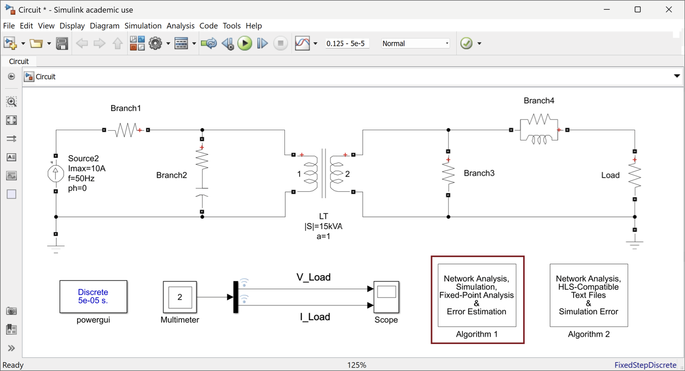
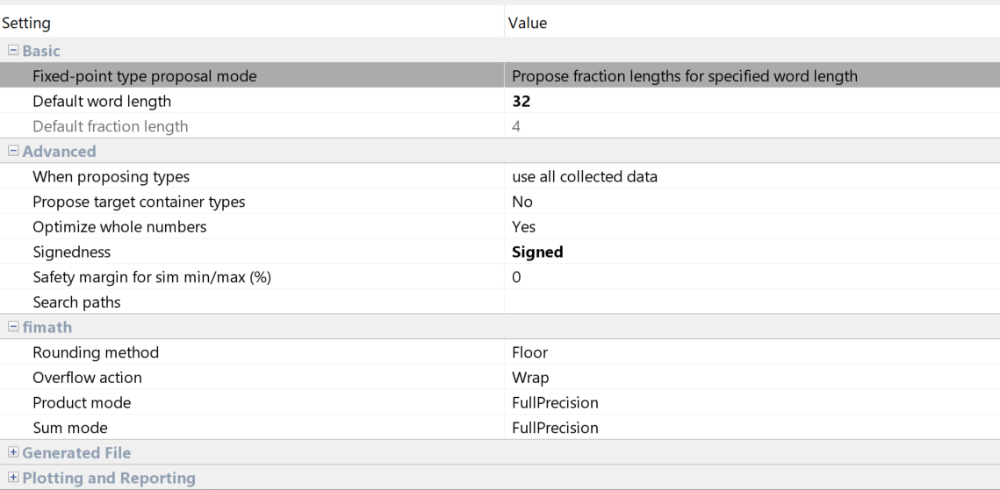
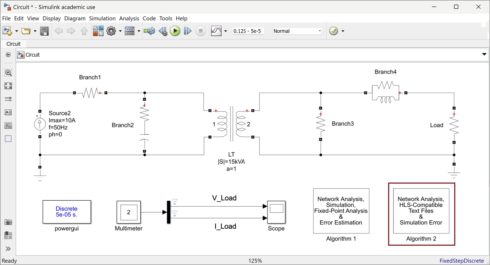

### Power System Simulation Platform
A real-time FPGA-based power system simulation platform developed as part of a diploma thesis. The platform integrates automation techniques and adaptive architecture selection, following a multi-stage workflow. It builds upon an existing framework for power system design and network analysis, leveraging integer fixed-point representation and using two distinct fraction lengths to achieve both high precision and resource efficiency. The platform categorizes the system in one of three input-based archtectures, depending on the type of sources (current, voltage, or both), and in one of three sized-based architectures, depending on its size (number of nodes).

#### Minimum Requirements
1. MATLAB R2017a
2. Vitis HLS 2020.2
3. Vivado 2020.2
4. Vitis 2020.2

#### Note
Newer versions of the software may be compatible, but the platform has been tested and validated with the versions listed above.

### Instructions - Target `Zynq UltraScale+ ZCU104 Evaluation Board`

#### Step 1: MATLAB/Simulink
1. Open the `power_system` directory.
2. Copy one of the `.slx` files in the `power_system` directory, open it, and click `Run` in the Simulink GUI to run the simulation.

3. Double-click `Algorithm 1` in the Simulink GUI. `Algorithm 1` performs simulation, network analysis, and decides the fraction lengths `f1` and `f2` for integer data representation. The fraction lengths are stored in the workspace and represent the maximum limits of each fraction length. Type `y` in the prompt window for error estimation between Simulink and the NIS method. Otherwise, press `n`.
 
4. (Optional) Alternatively, run the `Fixed-Point Converter` app manually if a deeper look into the fixed-point analysis is desired. Select `fun1Ibr.m`, `fun1Ihistory.m`, `fun1Ihs.m`, `fun2Ibr.m`, `fun2Ihistory.m`, `fun2Ihs.m`, and `Vnodal.m` as entry-point functions. If the network does not include transformers, omit `fun1Ibr.m`, `fun1Ihs.m`, and `fun2Ihistory.m`. Add `empts_app.m` as the script and click `Autodefine Input Types`. In the **Settings**, select `Propose fraction lengths for specified word length` and set the default word length to 32. Set `Signed` in the **Signedness** option and analyze.
 
5. Double-click `Algorithm 2` in the Simulink GUI. In the prompt window, specify `f1` and `f2` and type `1` to generate the text files for the HLS implementation.
 

