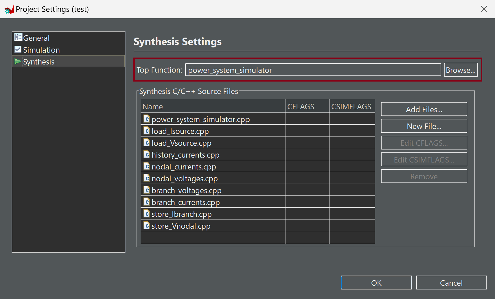
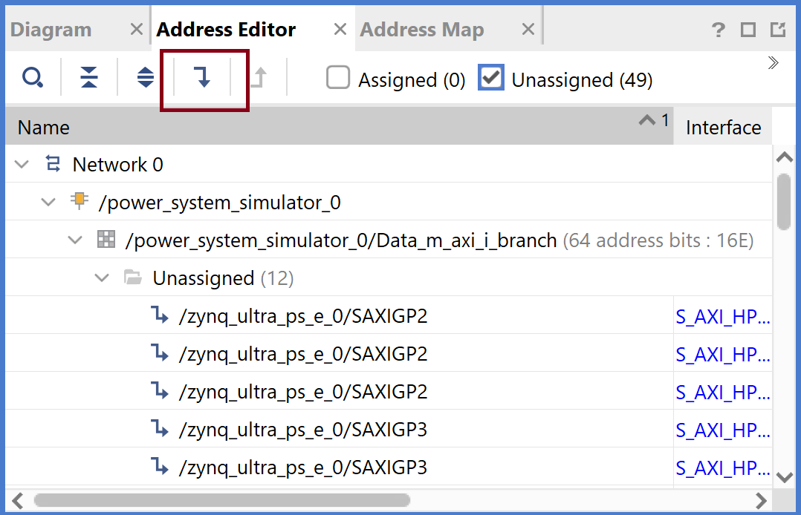

### Power System Simulation Platform
A real-time FPGA-based power system simulation platform developed as part of a diploma thesis. The platform integrates automation techniques and adaptive architecture selection, following a multi-stage workflow. It builds upon an existing framework for power system design and network analysis, leveraging integer fixed-point representation and using two distinct fraction lengths to achieve both high precision and resource efficiency. The platform categorizes the system in one of three input-based archtectures, depending on the type of sources (current, voltage, or both), and in one of three sized-based architectures, depending on its size (number of nodes).

#### Minimum Requirements
1. MATLAB R2017a
2. Vitis HLS 2020.2
3. Vivado 2020.2
4. Vitis 2020.2

Newer versions of the software may be compatible, but the platform has been tested and validated with the versions listed above.

### Instructions - Target: `Zynq UltraScale+ ZCU104 Evaluation Board`

#### Step 1: MATLAB/Simulink
1. Open the `power_system` directory.
2. Copy one of the `.slx` files into the `power_system` directory, open it, and click `Run` in the Simulink GUI to run the simulation.

3. Double-click `Algorithm 1` in the Simulink GUI. `Algorithm 1` performs simulation, network analysis, and decides the fraction lengths `f1` and `f2` for integer data representation. The fraction lengths are stored in the workspace and represent the maximum limits of each fraction length. Type `y` in the prompt window for error estimation between Simulink and the NIS method. Otherwise, press `n`.

4. (Optional) Alternatively, run the `Fixed-Point Converter` app manually if a deeper look into the fixed-point analysis is desired. Select `fun1Ibr.m`, `fun1Ihistory.m`, `fun1Ihs.m`, `fun2Ibr.m`, `fun2Ihistory.m`, `fun2Ihs.m`, and `Vnodal.m` as entry-point functions. If the network does not include transformers, omit `fun1Ibr.m`, `fun1Ihs.m`, and `fun2Ihistory.m`. Add `empts_app.m` as the script and click `Autodefine Input Types`. In the **Settings**, select `Propose fraction lengths for specified word length` and set the default word length to 32. Set `Signed` in the **Signedness** option and analyze.

5. Double-click `Algorithm 2` in the Simulink GUI. In the prompt window, specify `f1` and `f2` and type `1` to generate the text files for the HLS implementation.

#### Step 1: Notes
1. Custom power networks can consist of passive elements (any combination of resistors, inductors, and capacitors), linear transformers, and voltage and current sources. The compatible components are from the **Simscape Specialized Technology** library.

2. In the Simulink GUI, go to **Simulation** -> **Model Configuration Parameters** -> **Solver** -> Solver Options**. The **Solver** must be set to `discrete` and the **Type** to `Fixed-step` for correct error estimation. Similarly, the **Simulation Type** in the `powergui` block must be set to `Discrete`.

3. For the error estimation in `Algorithm 1` and the simulation error in `Algorithm 2` to work correctly, the `.slx` file must be named either `Sphase.slx` for single-phase networks or `Tphase.slx` for three-phase networks. Additionally, the `Multimeter` must have exactly one selected voltage measurement and one selected current measurement each time. The selected voltage and current measurements do not necessarily need to be from the same load or branch. For three-phase networks, 'one measurement' refers to a three-phase measurement.

4. In some cases, running `Algorithm 1` or `Algorithm 2` multiple times may result in different nodes assignment. To preserve the assignment used when exporting the text files, `Algorithm 1` stores it in the `Outputs_Info.m` file. Since this file is later used to compute the simulation error between Simulink and HLS or FPGA results, it is recommended to save it separately to avoid accidentally overriding it in subsequent runs.
5. Six Simulink models are included as test cases: three simple single-phase models demonstrating the input-based architectures, and three three-phase IEEE models, each corresponding to the size-based architectures. The chosen IEEE models did not require modifications to the models themselves.
6. The MATLAB/Simulink framework is based on an existing work. Modifications were made to adapt it to the specific requirements of this implementation.

#### Step 2: C++ Compiler
1. Open the `script` directory.
2. Copy all the MATLAB-generated text files into the directory.
3. Compile and run the `generate_headers.cpp` script. The script generates four header files: `constants.h`, `initial_state.h`, `input_sources.h`, and `ps_sim_host.h`.

#### Step 2: Note
The target FPGA used for implementation and testing is the `Zynq UltraScale+ ZCU104 Evaluation Board` and the C/C++ script is designed to work without modifications unless targeting a board with significantly different requirements or if maximum performance is not the goal. The script also provides a brief explanation of the available architectures and the criteria for choosing among them. In this case, the user may modify the following parts inside the script:
   * `buswidth`
   * `limit_full_unroll`
   * `limit_partial_unroll`
   * `unroll_factor`

#### Step 3: Vitis HLS
1. Open the `power_system_simulator` directory.
2. Copy the `constants.h`, `initial_state.h`, and `input_sources.h` files into the directory.
3. Open Vitis HLS and create a new project. In the **Design Files** section, add all `.cpp` files included in the `power_system_simulator` directory, except for the `power_system_simulator_test.cpp`. In the **Testbench Files** section, add the `power_system_simulator_test.cpp` file. In the **Solution Configuration** section, select the target FPGA board in the **part selection** and `Vivado IP Flow Target` in the **Flow Target**.

4. Once the project is open, navigate to **Project** -> **Project Settings** -> **Synthesis** -> **Top Function** and select `power_system_simulator.cpp`.

5. Navigate to **Solution** -> **Solution Settings** -> **General** -> **config_interface** and set the following :
   * **m_axi_max_bitwidth** = `128`
   * **m_axi_max_widen_bitwidth** = `128`
   * **m_axi_alignment_byte_size** = `16`

6. Run the steps: **C Simulation**, **C Synthesis**, **Co-Simulation**, and **Export RTL**, all with the default settings. 

#### Step 3: Notes 
1. If memory requirements are different, the general settings for **config_interface** in Vitis HLS are as follows:
   * **m_axi_max_bitwidth** = `buswidth`
   * **m_axi_max_widen_bitwidth** = `buswidth`
   * **m_axi_alignment_byte_size** = `buswidth/8`
2. Regarding the HLS implementation, in the modules `history_currents`, `branch_currents`, and `nodal_voltages`, there is an option to use the `#pragma HLS allocation` directive. Its purpose is to limit DSP utilization. While it works for relatively small reductions, larger reductions often lead to congestion. To use these directives, uncomment and set the desired number.
3. The testbench in Vitis HLS stores the C-Simulation and Co-Simulation results by default in the project directory: **project directory** -> **solution** -> **csim** -> **build**. Similarly, when exporting the RTL as an IP, the default directory is: **project directory** -> **solution** -> **impl** -> **ip**.
4. When exporting the RTL as an IP, `Vivado Synthesis` or `Vivado synthesis, place and route` must not be checked if the IP is intended for subsequent use in Vivado. However, `Vivado Synthesis` or `Vivado synthesis, place and route` can be used to obtain real results about resource utilization of the IP as a standalone module.

#### Step 4: MATLAB/Simulink (Optional) 
1. Copy the `HLS_V` and `HLS_I` directories that HLS Simulation created into the `power_system` directory.
2. Open the `.slx` file and click `Run` in the Simulink GUI to run the simulation.
3. Double-click `Algorithm 2` in the Simulink GUI. In the prompt window, specify `f1` and `f2` and type `2` to compare the HLS results with the Simulink results.

#### Step 5: Vivado

1. Open Vivado and create a new project. In the **Project Type** section, leave the settings at default. In the **Default Part** section, choose the target FPGA board.

3. Once the project is open, navigate to **Tools** -> **Settings** -> **Project Settings** -> **IP** -> **Repository** and add the HLS-generated IP.

5. Navigate to **IP INTEGRATOR** and click `Create Block Design`.

7. In the **Diagram** section, add the `ZYNQ Ultrascale+ MPSoC` block. Click `Run Block Automation` and apply the board preset. Then, double-click the `ZYNQ Ultrascale+ MPSoC` block and navigate to **PS-PL Configuration** -> **PS-PL Interfaces**. In the **Master Interface** section, select `AXI HPM0 FPD`. In the **Slave Interface** section, select `AXI HP0 FPD`, `AXI HP1 FPD`, and `AXI HP2 FPD`. If the network has both voltage and current sources, select additionally `AXI HP3 FPD`.
   

9. In the **Diagram** section, add these IP blocks: `Processor System Reset`, `AXI Interconnect`, `AXI SmartConnect`, and `Power_system_simulator`. Set the appropriate masters and slaves, and connect all blocks accordingly.

10. Navigate to the **Address Editor** section and click `Assign All`. Then, navigate to the **Diagram** section and click `Validate Design`.

11. Navigate to **Sources** -> **Design Sources**. Under **Design Sources**, right-click and select `Generate Output Products`. In the **Synthesis Options** section, select `Global` and click `Generate`. Right-click again and select `Create HDL Wrapper`. Choose `Let Vivado manage wrapper and auto-update`.

12. Navigate to **PROGRAM AND DEBUG** and click `Generate Bitstream`. Let Vivado handle the intermediate steps.

13. Once finished, navigate to **File** -> **Export** -> **Export Hardware**. In the **Output** section, choose `Include Bitstream` and export the `.xsa` file.

